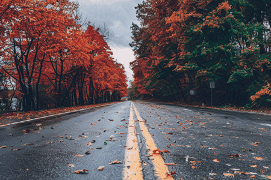

# Neural-Style-Transfer 🎨
## Environment Setup

1. Clone this repository
```
git clone https://github.com/choudharyc/Neural-Style-Transfer.git
```
2. Navigate to the repo:
```
cd ./Neural-Style-Transfer
```
3. Create a virtual python environment using venv: 
```
python -m venv nst_venv
```
4. Activate the environment: 
```
source nst_venv/bin/activate (for Linux/macOS)
nst_venv\Scripts\activate.bat (for Windows)
```
5. Install the required packages: 
```
pip install -r requirements.txt
```


## Usage

To run the NST algorithm, simply run ```python main.py```.
<p align="center">





The parameter <i>init_method</i> can be used to initialize the output image in multiple ways. 
- Setting it to 'content' initializes the output image to the content image. This setting produces the best results.
- Setting it to 'noise' initializes the output image to random noise. This setting also produced some good results, but needed more tuning of loss weights.

By setting <i>reconstruction_type</i> parameter to:
- 'content', we can reconstruct only the contents of the content image (set *init_method* = 'noise')
- 'style', we can recreate the stylsitic properties of the style image (set *init_method* = 'noise')
- 'both', we can create a combined image which has the contents of the content image and style attributes of the style image (aka NST)


